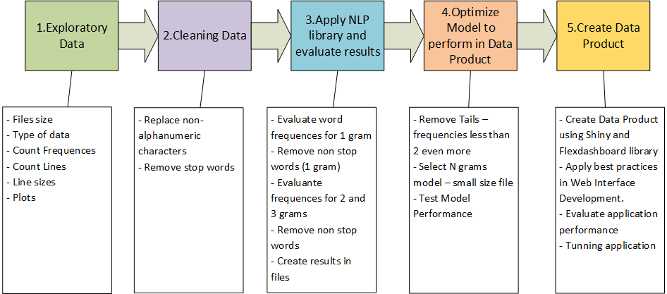
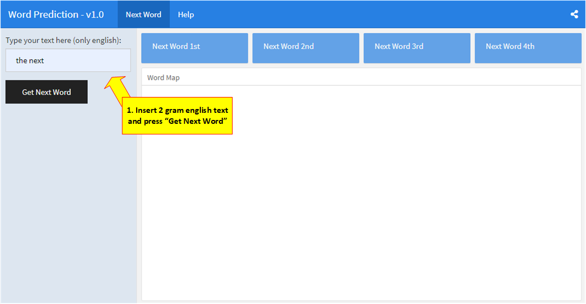
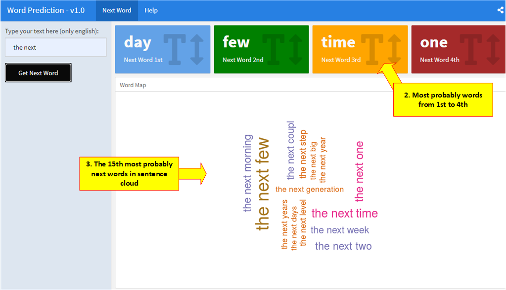

```{r setup, include=FALSE}
knitr::opts_chunk$set(echo = FALSE)
```

## Background

### Problem
Applying Data Science in area of NLP to create basic data product and create developing approach for any further language. As start point it´s was used english as language.   


### Objectives
1. Create a Data Product using [NLP (Natural Language Pocessing)](https://en.wikipedia.org/wiki/Natural_language_processing) method to predict next word in a english language sentence.
2. Develop an approach to create any NLP processing for further application in other languages. 
 
 
## Approach

The approach used in this project is present in picture bellow.



## DataProduct and Features

The app [Word Prediction v1.0](https://speed-junior.shinyapps.io/nextwordapp/) is available in [shinyapps.io](https://www.shinyapps.io/) platform to publish R apps



## DataProduct and Features




## More Info

- Developed by: **Expedito Pinto de Paula Junior**
- Course: **Capstone**
- Description: This Data Product it was developed using *flexdashboard* and *shiny*
- Version: 1.0
- Date: Dec 10, 2020

### Links
- [Capstone Project](https://github.com/speedjuniorbr/Coursera-Capstone)
- [Shiny App - Word Prediction - v1.0](https://speed-junior.shinyapps.io/nextwordapp/)
- [Exploratory Data Analysis](https://rpubs.com/speedjunior/exploratorynlp)

